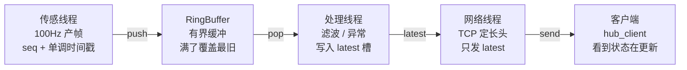

# Telemetry Hub

最终可演示项目。Day24–27 往**这一份代码**里加厚，不要每天另起工程。

位置：`week4-project/telemetry-hub/`

建议布局：

```
include/     头文件（RingBuffer、协议、Hub）
src/         实现与 main
tests/       单测
```

## 现在写到哪了

第 2 步：**产 + 处理 + TCP 发 latest**。`main` 不再打印；网络线程 `accept` 后按定长头发 `latest`。

必须在 **WSL / Linux** 编（用了 `socket`/`htonl`）。先重配再编：

```bash
cd week4-project/telemetry-hub
cmake -S . -B build -DCMAKE_BUILD_TYPE=Debug
cmake --build build
./build/hub_server 7777          # 终端 A
ss -lntp | grep 7777             # 应有 LISTEN
./build/hub_client 127.0.0.1 7777  # 终端 B，seq 应持续涨
```

杀 client 再开一个，server 不用重启。Ctrl+C server 两边停。

## 现在写到哪了

第 2 步 TCP 已接通。刚加上 **运行时日志级别**（还没做滤波）。

```bash
./build/hub_server 7777 --log=info    # 默认：启动 + 每秒 hz_in/hz_out/drop
./build/hub_server 7777 --log=warn    # 更安静，几乎只在出错/断开时出字
./build/hub_server 7777 --log=debug   # 每发出一帧打 seq（会很吵）
```

`drop` 为环覆盖累计。`anom` 为这一秒跳变次数（见下）。

控制线程已做 **相邻帧跳变打标**（方案 C）：任一轴变化 > 0.5 则 `flags` bit0=1。假数据 `ax` 每 100 个 seq 从 0.99 掉回 0，client 应偶尔看到 `flags=1`。两边都要重编，payload 已从 20 改为 24 字节。

---

## 架构：产 / 处理 / 发

面试就画这张图。`net` 和 `control` 可以合并成一条线程，那是实现细节；讲的时候三块职责仍要分开。



`main` 线程：`sigaction(SIGINT / SIGTERM)` → handler **只写** `g_running = false` → 唤醒 → `join` → flush / close。不要在 handler 里打日志、加锁、`join`。

| 块 | 干什么 | 对应课 |
|----|--------|--------|
| **产** | 传感线程约 100Hz 造一帧（`seq`、单调时间戳、几个 float），`push` 进 RingBuffer。环满不阻塞，覆盖最旧。 | Day12 |
| **处理** | 取出最新帧，轻处理（去抖、限幅、标异常），写入 `latest` 槽。Day24 可以近乎透传。 | Day13 / Day25 |
| **发** | `socket → bind → listen → accept`，按「4 字节长度 + payload」发 `latest`。网络慢就丢中间帧。 | Day22 / Day23 |

讲不清就是把三件事糊成了一个 `while` 循环：谁定频、谁决定丢哪一帧、谁负责字节边界。

---

## 四天往同一份代码里加什么

| 课程日 | 加的东西 | 跑起来先看 |
|--------|----------|------------|
| Day24 | 接通产线：三条线程 + TCP 发最新 | `ss -lntp` 有 LISTEN；`top -H` 线程都在 |
| Day25 | 处理层滤波 / 异常；日志级别可关 | 日志关掉后 CPU 是否降下来 |
| Day26 | 压测：延迟 P50/P99、丢包，修 1 个点 | `top` / `perf stat`，对照 Day24 基线 |
| Day27 | README 编译运行、断线重连 | `ldd`、一键 `run.sh`，别人 5 分钟复现 |

---

## 30 秒口述

传感线程定频产帧进有界环，满了覆盖最旧；处理线程取最新做轻处理写进 `latest`；网络线程按定长头把 `latest` 发给客户端，网络慢就丢中间帧。Ctrl+C 时 handler 只置一个 `atomic`，主线程唤醒、join、刷日志再退出。排障先 `ss` 看在不在听，再 `top -H` 看线程，卡住用 `strace`。
